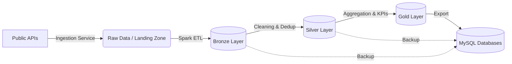

# Azure Databricks Retail Pipeline

This project implements a complete end‑to‑end Data Engineering pipeline simulating a Databricks Lakehouse environment.  
The system ingests data from public APIs, processes it through a Medallion Architecture (Bronze, Silver, Gold) using PySpark, and exports the results to MySQL databases for business analytics.

---

## Architecture Overview

The pipeline follows the Medallion Architecture to ensure data quality, lineage, and governance across all stages.



---

## Data Flow and Layers

### Ingestion (Landing Zone)
- Extracts product data from FakeStoreAPI and user data from RandomUser.me.  
- Generates simulated sales transactions using business rules.  
- Stores raw files locally in CSV/JSON format.

### Bronze Layer (Raw)
- Loads raw data into the Data Lake.  
- Adds ingestion metadata (timestamps).  
- Stored as Parquet files and Spark tables.  
- MySQL destination: `bronze_retail`.

### Silver Layer (Cleaned)
- Cleans and standardizes data types.  
- Applies data quality rules (e.g., removes negative transaction values).  
- Deduplicates records.  
- Stored as Parquet files and Spark tables.  
- MySQL destination: `silver_retail`.

### Gold Layer (Aggregated)
- Enriches data by joining sales with user information.  
- Computes business KPIs such as revenue by category and country.  
- Provides analytics‑ready datasets for dashboards.  
- Stored as Parquet files and Spark tables.  
- MySQL destination: `gold_retail`.

---

## Technologies Used

- Python 3.12+  
- Apache Spark (PySpark)  
- Parquet and simulated Delta Lake  
- MySQL 8.0  
- Requests, Tenacity  
- Modular Python orchestration scripts  

---

## Prerequisites

Ensure the following are installed:

- Python 3.12+  
- Java 8 or 11 (OpenJDK) for Spark  
- MySQL Server running on port 3306  

---

## Installation and Setup

### 1. Clone the repository

```bash
git clone https://github.com/seu-usuario/azure-databricks-retail-pipeline.git
cd azure-databricks-retail-pipeline
```

### 2. Create a virtual environment and install dependencies

```bash
python -m venv .venv
source .venv/bin/activate  # Windows: .venv\Scripts\activate
pip install -r requirements.txt
```

### 3. Configure MySQL credentials

Edit `src/retail_pipeline.py`:

```python
self.mysql_properties = {
    "user": "root",
    "password": "YOUR_PASSWORD_HERE",
    "driver": "com.mysql.cj.jdbc.Driver"
}
```

---

## Running the Pipeline

Execute the full workflow:

```bash
python main.py
```

### Execution Steps

- Cleans temporary files from previous runs.  
- Downloads API data and generates `sales_transactions.csv`.  
- Runs Spark ETL to populate Bronze, Silver, and Gold layers.  
- Exports processed data to MySQL databases.  
- Prints a final execution report in the terminal.

---

## Project Structure

```
azure-databricks-retail-pipeline/
├── data/                      # Local Data Lake
│   ├── raw/                   # Landing Zone (CSV/JSON)
│   ├── warehouse/             # Parquet Storage
│   └── spark-warehouse/       # Spark Metadata
├── sql/
│   └── retail_schema.sql      # SQL Documentation
├── src/
│   ├── ingestion_service.py   # API Ingestion Logic
│   └── retail_pipeline.py     # Spark Pipeline
├── main.py                    # Orchestrator Script
├── requirements.txt           # Dependencies
└── README.md                  # Documentation
```

---

## Results and Analysis

After execution, the following MySQL tables are created or updated:

| Database       | Table                | Description                                   |
|----------------|----------------------|-----------------------------------------------|
| bronze_retail  | sales_transactions   | Full raw transaction history                  |
| silver_retail  | sales_clean          | Cleaned and standardized data                 |
| gold_retail    | category_performance | Revenue aggregated by country and category    |

---

## Author

**Willian Phaiffer Cardoso**  
Developed as part of a Data Engineering portfolio.